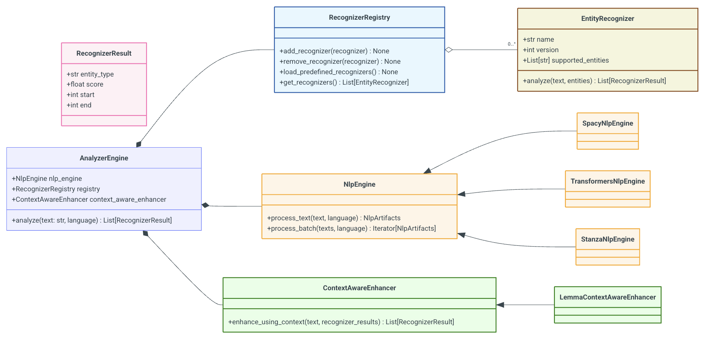

# Korean PII Safe Annotator

A simple and powerful web application designed to anonymize Personally Identifiable Information (PII) in Korean text. This tool replaces detected PII with placeholder tags (e.g., `<PERSON>`, `<KR_PHONE_NUMBER>`), making the text safe for use in data annotation, logging, or analysis without exposing sensitive user data.

The application is built with Python, Flask, and the Microsoft Presidio framework, leveraging a sophisticated hybrid model for PII detection.


## Key Features

-   **Simple Web Interface:** A clean, two-panel UI to input raw text and instantly see the anonymized output.
-   **High-Accuracy PII Detection:** Utilizes a hybrid approach combining rule-based logic and a state-of-the-art AI model for comprehensive detection.
-   **Real-time Processing:** Anonymizes text on the fly with an efficient backend.
-   **Efficient Model Handling:** The large AI models are loaded only once on server startup, ensuring fast processing for all subsequent requests.
-   **Ready for Deployment:** Includes a production-ready setup using Gunicorn.

---

## The PII Detection & Replacement Process

This application's strength lies in its **hybrid detection model**, which uses two complementary strategies to identify PII with high accuracy.



### 1. Rule-Based Recognizers (For Structured PII)

We use custom-built, high-precision recognizers for structured data formats that follow predictable patterns. This method is fast, accurate, and essential for data types that a traditional AI model might miss.

| PII Entity | Detection Method | Description |
| :--- | :--- | :--- |
| **KR_RESIDENT_REGISTRATION_NUMBER** | Regex + Checksum Algorithm | Identifies Korean RRNs and validates them using the official checksum algorithm to eliminate false positives. |
| **KR_PHONE_NUMBER** | Enhanced Regex | Detects various common mobile and landline phone number formats. |
| **KR_BANK_ACCOUNT_NUMBER** | Generic Regex | Identifies common bank account number formats. |
| **EMAIL_ADDRESS** | Presidio's Built-in Regex | Uses a robust, pre-built recognizer for finding email addresses. |

### 2. Zero-Shot NER Model (GLiNER for Custom PII)

**This is a key component for flexibility.** We use GLiNER (Generalist Line-based Named Entity Recognizer), a powerful model that can detect entities it has never been explicitly trained on.

-   **Model:** `taeminlee/gliner_ko`
-   **Function:** GLiNER operates on a "zero-shot" basis. We provide it with a list of labels for PII types we want to find (e.g., "Passport Number", "Credit Card Number"), and it finds them in the text without any retraining. This makes the system **highly extensible** and allows for the easy addition of new, custom PII types.

### 3. Pre-trained NER Model (For Common Contextual PII)

To catch common PII that doesn't follow strict rules or custom definitions, we leverage a traditional NLP model fine-tuned for Korean Named Entity Recognition (NER).

-   **Model:** `Leo97/KoELECTRA-small-v3-modu-ner`
-   **Function:** This model identifies entities based on linguistic context, finding PII such as:
    -   **PERSON (`<PERSON>`)**: Names of people.
    -   **LOCATION (`<LOCATION>`)**: Addresses, cities.
    -   **ORGANIZATION (`<ORGANIZATION>`)**: Company names.

### 4. The Replacement Strategy

After the AnalyzerEngine aggregates the results from all three layers, the AnonymizerEngine substitutes the identified PII string with its entity type (e.g., `홍길동` becomes `<PERSON>`). This preserves context while completely removing sensitive data, making it ideal for safe annotation.

---

## Technology Stack

-   **Backend:** Python 3.9+, Flask
-   **PII Engine:** Microsoft Presidio
-   **NLP Models:**
    -   Hugging Face Transformers (`Leo97/KoELECTRA-small-v3-modu-ner`)
    -   GLiNER (`taeminlee/gliner_ko`)
    -   spaCy (`ko_core_news_sm`) for Korean tokenization
-   **Frontend:** HTML5, CSS3, Vanilla JavaScript
-   **Deployment:** Gunicorn

---

## Setup and Installation

Follow these steps to get the application running on your local machine.

### 1. Prerequisites

-   Python 3.9 or higher.
-   An internet connection to download the required models.

### 2. Clone the Repository

```bash
git clone <your-repository-url>
cd pii_annotator_app
